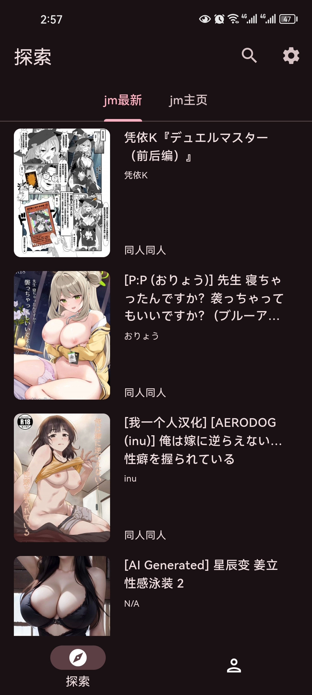
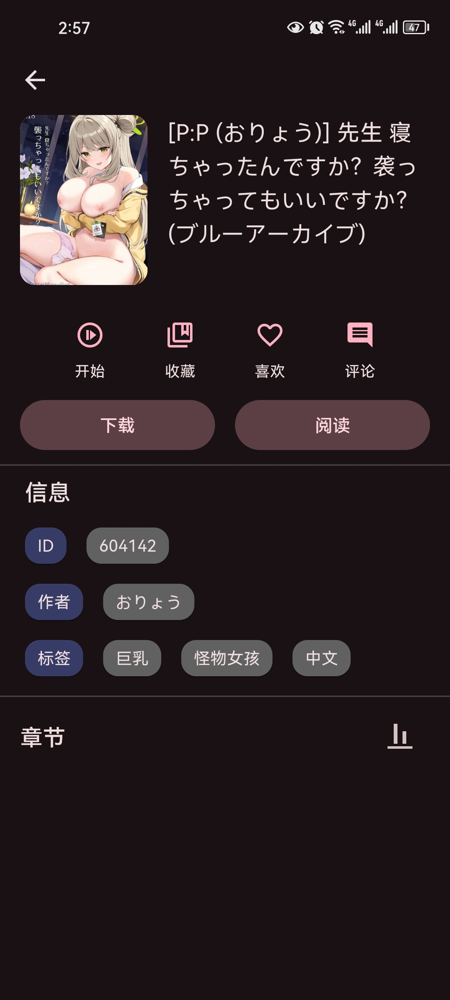
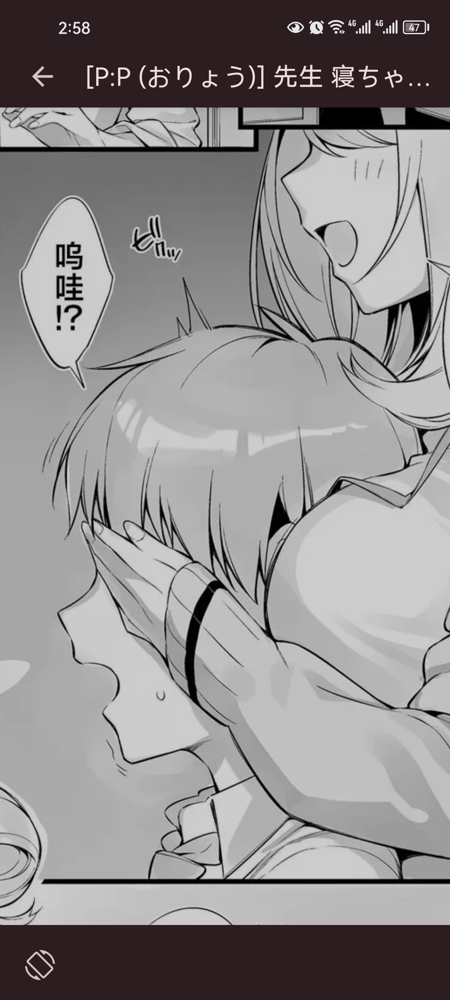
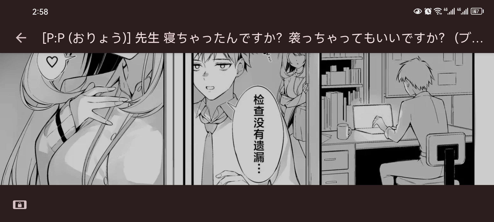

# jmcomic

 

练手的项目，一个盗版的不完整的禁漫天堂。

## 功能

- 禁漫主页（最新页）
- 禁漫详情页
- 漫画观看（从上到下连续模式、放大缩小、方向旋转）

## 开发中遇到的问题

- 问题0：Android Studio自带的虚拟机有坑，可以使用MuMu模拟器之类的（速度快，调试方便，不容易卡死）
- 解决0：命令行直接运行adb connect 127.0.0.1:7555即可自动连接（每个模拟器端口不一样，雷电模拟器是5555）
- 问题1：在安卓虚拟机可以正常运行，但是安装到物理机后‘灰屏’卡死
- 解决1：Expanded组件必须在Row等组件中（所以为什么虚拟机就可以正常运行）
- 问题2：关于UI模式为immerse（全屏），状态栏依旧占用空间（一个黑条）
- 解决2：向android/app/src/main/res/values/styles.xml中的style标签里加入\<item name="android:windowLayoutInDisplayCutoutMode">shortEdges\</item>
- 问题3：安装在物理机上无法联网
- 解决3：在网上搜就可以得到答案，向两个AndroidManifest.xml中加入一些配置
- 问题4：打包为windows版居然还需要VS2022
- 解决4：下载VS2022
- 问题5：如何运行我的代码、如何在我的代码基础上进行二次开发
- 解决5：新创建一个flutter项目，直接复制我的lib目录去覆盖你的，复制我的pubspec.yaml文件去覆盖你的
- 问题6：本项目的图片亮度没有原作者的亮，韩漫的图片会发生错位，windows端观看时漫画图片之间有空隙，放大缩小的手势不灵敏（电脑端需要触摸屏才可以放大缩小）
- 解决6：未解决

## 感谢

本项目所有的代码都抄袭和修改自它，包括README格式。

## 项目展示

